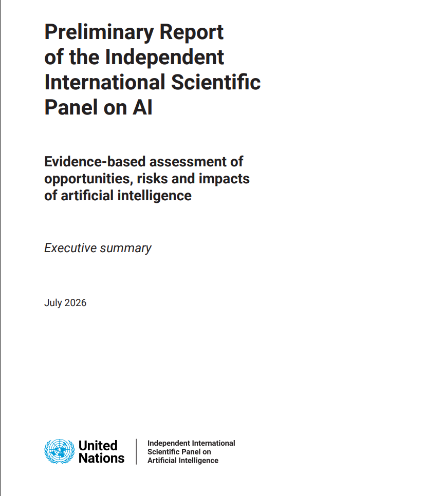
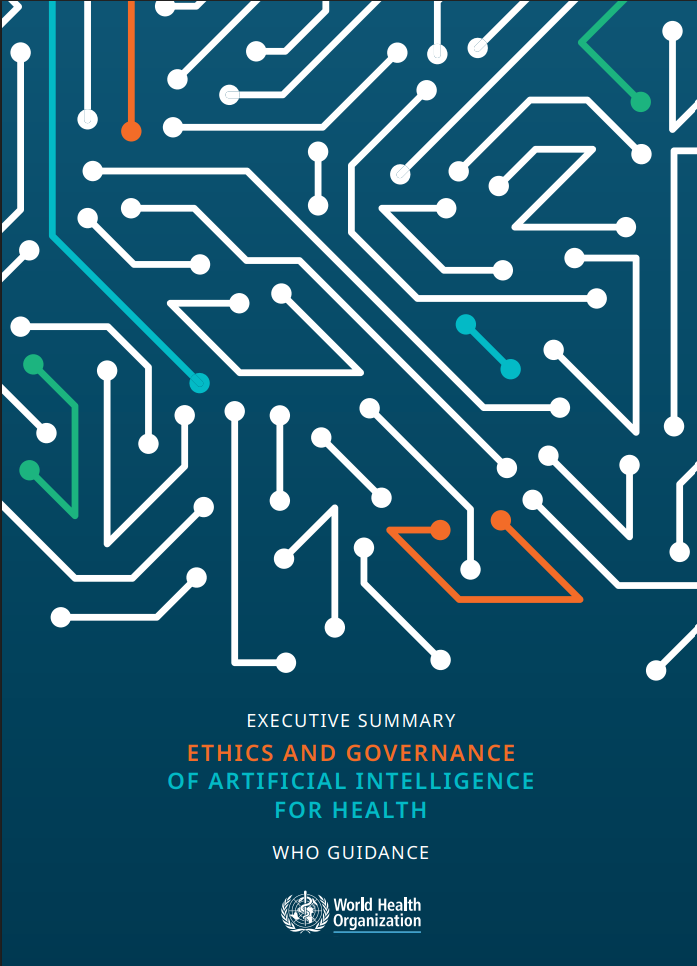
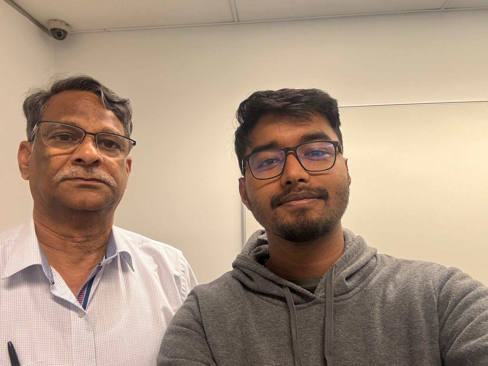

# e-Portfolio 1 – Artificial Intelligence

A collection of artefacts that demonstrate what I have learnt about Artificial Intelligence this week.

---

# Artefact 1: Why Generative AI is Truly Revolutionary – An Interview with Jerry Kaplan

## Screenshot

---

## Link

https://www.youtube.com/watch?v=JcXKbUIebrU&t=14s

---

## Summary of the Artefact

This YouTube interview features AI expert Jerry Kaplan, who explains why generative artificial intelligence is considered one of the most significant technological developments of recent years. He discusses how generative AI systems, such as ChatGPT, are trained on large amounts of data to recognise patterns and generate human-like responses rather than truly understanding information like humans do. Kaplan also explores how this technology is changing industries including education, healthcare, software development, and business by improving productivity and supporting decision-making. At the same time, he highlights important challenges such as misinformation, bias, privacy concerns, and the need for responsible AI governance. Overall, the interview provides a clear and balanced explanation of how generative AI works, its growing impact on society, and why both individuals and organisations should use it ethically and responsibly.

## Justification on Why I Chose the Artefact

I chose this video because it was recommended in this week's lecture and provided a simple introduction to generative artificial intelligence. Before watching it, I knew about tools such as ChatGPT, but I did not fully understand how they worked or why they are considered different from traditional AI systems. Jerry Kaplan explains these concepts in an easy-to-follow way using practical examples, which helped me better understand how AI learns from large amounts of data and produces human-like responses. This made the topic much easier for me to understand.

I also selected this artefact because it connects closely with the unit's discussion of AI ethics, governance, and the impact of technology on society. The interview encouraged me to think about both the opportunities and challenges of generative AI, including issues such as bias, misinformation, privacy, and accountability. It helped me realise that although AI has the potential to improve many industries, it must be developed and used responsibly. This artefact demonstrates my learning because it strengthened my understanding of how generative AI is transforming society and why ICT professionals have an important responsibility to ensure that AI is used ethically and for the benefit of everyone.

---

# Artefact 2: United Nations Preliminary Report on Artificial Intelligence

## Screenshot

---

## Link

https://www.un.org/independent-international-scientific-panel-ai/sites/default/files/2026-07/en_executive_summary.pdf

---

## Summary of the Artefact

This executive summary was published by the United Nations Independent International Scientific Panel on Artificial Intelligence and provides an overview of how AI is affecting people, businesses, and governments around the world. The report explains that artificial intelligence has the potential to improve many areas, including healthcare, education, scientific research, and economic development. However, it also highlights important challenges such as misinformation, privacy concerns, cybersecurity threats, bias, inequality, and the environmental impact of AI technologies. The report points out that AI is advancing faster than governments can develop appropriate regulations, making effective governance increasingly important. It encourages countries to work together to create responsible policies and ethical standards that ensure AI is developed safely, fairly, and for the benefit of everyone. Overall, the report shows that while AI offers many opportunities, careful management and international cooperation are essential to minimise risks and maximise its positive impact on society.

---

## Justification on Why I Chose the Artefact

I chose this report because it was published by the United Nations, which makes it a trustworthy and reliable source of information. I wanted to learn about artificial intelligence from an official report rather than relying only on news articles or social media. The report helped me understand that AI is much more than just tools like ChatGPT. It is a technology that is influencing healthcare, education, businesses, scientific research, and governments around the world. Reading the report also made me realise that although AI offers many benefits, it can create serious challenges such as privacy concerns, misinformation, bias, and cybersecurity risks if it is not managed responsibly.

I also selected this artefact because it closely relates to the topics covered in this week's lecture, including AI ethics, governance, accountability, and the responsible use of artificial intelligence. The report reinforced my understanding that governments, organisations, and technology developers all have a responsibility to ensure AI is developed fairly and ethically. It also showed me the importance of international cooperation in creating policies that protect people while encouraging innovation. This artefact is meaningful evidence of my learning because it demonstrates how the concepts discussed in class are being applied by global organisations to address the real-world opportunities and challenges of artificial intelligence.

---

# Artefact 3: Mapping the Application of Artificial Intelligence in Traditional Medicine

## Screenshot

---

## Link

https://iris.who.int/server/api/core/bitstreams/4f2c477c-4b72-4ca1-9a78-a1e73af64e50/content

---

## Summary of the Artefact

This report was published by the World Health Organization (WHO) and examines how artificial intelligence is being used to support traditional medicine. It explains that AI can analyse large amounts of medical information to assist researchers, improve disease diagnosis, and help healthcare professionals identify more effective treatment options. The report also highlights how AI can preserve valuable traditional medical knowledge while combining it with modern healthcare technologies to improve patient care and make healthcare services more accessible. In addition to these benefits, the report discusses several important challenges, including protecting patient privacy, reducing bias in AI systems, ensuring transparency, and using reliable scientific evidence when applying AI in healthcare. Overall, the report emphasises that AI should be used to support healthcare professionals rather than replace them, while ensuring that ethical principles, patient safety, and cultural knowledge remain central to healthcare decision-making.

---

## Justification on Why I Chose the Artefact

I chose this report because it introduced me to a different way that artificial intelligence can be used in healthcare. Before reading it, I mostly thought of AI as a tool for diagnosing diseases or analysing medical images. However, this report showed me that AI can also help preserve traditional medical knowledge, support scientific research, and improve healthcare services by combining traditional practices with modern technology. Since the report was published by the World Health Organization, I considered it a reliable and trustworthy source that is based on research and expert knowledge. It gave me a broader understanding of how AI can benefit healthcare beyond the areas I was already familiar with.

I also selected this artefact because it relates closely to the topics discussed in this week's lecture, including AI ethics, governance, responsible AI, and the impact of technology on society. The report helped me understand that while AI has the potential to improve healthcare, it must be developed and used responsibly to protect patient privacy, reduce bias, and respect cultural values. It reinforced the importance of creating ethical guidelines and strong governance to ensure AI is used safely and fairly. I believe this artefact is meaningful evidence of my learning because it demonstrates how artificial intelligence can support innovation in healthcare while maintaining trust, fairness, and patient wellbeing.

---

# Artefact 4: Workshop 2 – Artificial Intelligence Discussion and Activities

## Week 2 workshop(Thrusday 23/07/2026) selfie with my tutor Umapathy Venugopal sir 

---

## Workshop Topic

**Week 2 – Artificial Intelligence**

---

## Summary of the Artefact: My Personal Reflection

Participating in the Week 2 workshop helped me develop a much better understanding of artificial intelligence and its role in today's society. Before the workshop, I mainly thought of AI as tools like ChatGPT that answer questions or generate content. However, through the class discussions and activities, I learned that AI is much broader than I had imagined. I discovered how AI has evolved over time, from symbolic AI to machine learning and today's generative AI, and how technologies such as robotics, computer vision, speech recognition, and natural language processing are used in many different industries.One part of the workshop that I found particularly interesting was watching Jerry Kaplan's interview on generative AI. His explanation helped me understand both the opportunities and challenges of AI in a simple way. The discussions about AI ethics and Australia's AI Ethics Principles also made me realise that AI should not only focus on innovation but also on fairness, transparency, accountability, and protecting people's privacy. Overall, this workshop changed the way I think about artificial intelligence. It showed me that as future ICT professionals, we have a responsibility to develop and use AI ethically so that it benefits society while reducing potential risks.

---

## Justification on Why I Chose the Artefact

I chose this workshop as my fourth artefact because it gave me the opportunity to actively participate in discussions and apply the concepts I learned during the lecture. The workshop activities helped me understand how artificial intelligence has developed over time and how it is being used in different industries today. Discussing real-world examples with my classmates and watching the Jerry Kaplan interview made the topics much easier to understand. It also encouraged me to think more carefully about both the advantages of AI and the ethical challenges that come with using this technology.

This workshop also helped me connect the theory covered in class with real-world issues affecting society. I learned that although artificial intelligence can improve areas such as healthcare, education, and business, it also raises important concerns about privacy, bias, transparency, and accountability. But the interesting part was the tricky question by our tutor although which help to clear many concept about mind, intelligence and human thought process. The workshop reinforced the importance of responsible AI governance and showed me that ICT professionals have a responsibility to develop and use AI in ethical ways that benefit society while reducing potential risks. I believe this artefact is meaningful evidence of my learning because it reflects both my active participation in the workshop and my growing understanding of the ethical and social impacts of artificial intelligence. At the very end of the class I took the selfie with our tutor.

---

### Harvard Reference

Kaplan, J. 2024, *Why Generative AI is Truly Revolutionary: An Interview with Jerry Kaplan*, YouTube video, viewed **(insert access date)**, <https://www.youtube.com/watch?v=JcXKbUIebrU&t=14s>.

United Nations 2026, *Preliminary Report of the Independent International Scientific Panel on Artificial Intelligence: Evidence-based Assessment of Opportunities, Risks and Impacts of AI – Executive Summary*, United Nations, viewed **26 July 2026**, <https://www.un.org/independent-international-scientific-panel-ai/sites/default/files/2026-07/en_executive_summary.pdf>.

World Health Organization 2025, *Mapping the application of artificial intelligence in traditional medicine*, World Health Organization, viewed 26 July 2026, <https://iris.who.int/server/api/core/bitstreams/4f2c477c-4b72-4ca1-9a78-a1e73af64e50/content>.

Central Queensland University 2026, *COIT11223 ICT Ethics and Governance in Society: Week 2 Workshop – Artificial Intelligence*, workshop presentation, Central Queensland University.
