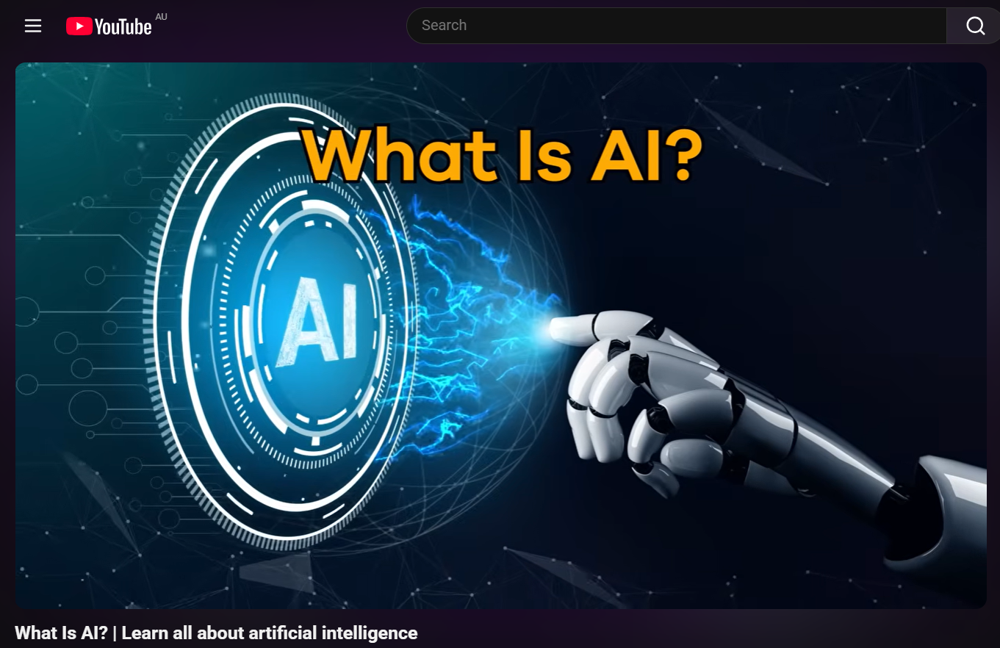

# e-Portfolio 1 – Artificial Intelligence

A collection of artefacts that demonstrate what I have learnt about Artificial Intelligence this week.

---

# Artefact 1: Why Generative AI is Truly Revolutionary – An Interview with Jerry Kaplan

## Screenshot

---

## Link

https://www.youtube.com/watch?v=JcXKbUIebrU&t=14s

---

## Summary of the Artefact

This YouTube interview features AI expert Jerry Kaplan, who explains why generative artificial intelligence is considered one of the most significant technological developments of recent years. He discusses how generative AI systems, such as ChatGPT, are trained on large amounts of data to recognise patterns and generate human-like responses rather than truly understanding information like humans do. Kaplan also explores how this technology is changing industries including education, healthcare, software development, and business by improving productivity and supporting decision-making. At the same time, he highlights important challenges such as misinformation, bias, privacy concerns, and the need for responsible AI governance. Overall, the interview provides a clear and balanced explanation of how generative AI works, its growing impact on society, and why both individuals and organisations should use it ethically and responsibly.

## Justification on Why I Chose the Artefact

I chose this video because it was recommended in this week's lecture and provided a simple introduction to generative artificial intelligence. Before watching it, I knew about tools such as ChatGPT, but I did not fully understand how they worked or why they are considered different from traditional AI systems. Jerry Kaplan explains these concepts in an easy-to-follow way using practical examples, which helped me better understand how AI learns from large amounts of data and produces human-like responses. This made the topic much easier for me to understand.

I also selected this artefact because it connects closely with the unit's discussion of AI ethics, governance, and the impact of technology on society. The interview encouraged me to think about both the opportunities and challenges of generative AI, including issues such as bias, misinformation, privacy, and accountability. It helped me realise that although AI has the potential to improve many industries, it must be developed and used responsibly. This artefact demonstrates my learning because it strengthened my understanding of how generative AI is transforming society and why ICT professionals have an important responsibility to ensure that AI is used ethically and for the benefit of everyone.

---

# Artefact 2: United Nations Preliminary Report on Artificial Intelligence

## Screenshot

---

## Link

https://www.un.org/independent-international-scientific-panel-ai/sites/default/files/2026-07/en_executive_summary.pdf

---

## Summary of the Artefact

This executive summary was published by the United Nations Independent International Scientific Panel on Artificial Intelligence. The report provides an evidence-based assessment of the opportunities, risks, and impacts of artificial intelligence on society. It explains that AI is transforming many sectors, including healthcare, education, scientific research, and the global economy, while also creating significant challenges related to human rights, misinformation, cybersecurity, privacy, inequality, and environmental sustainability. The report highlights that AI technology is developing much faster than current governance and regulatory systems can respond. As a result, it calls for stronger international cooperation, scientific research, and responsible governance to ensure that AI is developed safely and benefits all countries equally. Overall, the report emphasises that effective AI governance is essential to maximise the benefits of AI while reducing potential risks to society. :contentReference[oaicite:0]{index=0}

---

## Justification on Why I Chose the Artefact

I chose this report because it is an official publication from the United Nations, making it a highly reliable and credible source of information. Unlike many news articles or opinions, this report presents scientific evidence from international experts about both the benefits and risks of artificial intelligence. It helped me understand that AI is not only a technological innovation but also a global issue that affects governments, businesses, and individuals. Reading this report broadened my perspective on how AI can improve areas such as healthcare, education, and scientific research while also creating ethical concerns that require careful management.

This artefact also connects directly with the topics discussed in this week's lecture, particularly AI ethics, governance, accountability, fairness, and responsible use of artificial intelligence. It reinforced my understanding that technology should be developed with human wellbeing in mind and that international cooperation is necessary to ensure AI remains safe, transparent, and beneficial for everyone. I believe this report is meaningful evidence of my learning because it demonstrates how the concepts studied in class are being applied by global organisations to address real-world challenges created by artificial intelligence. :contentReference[oaicite:1]{index=1}

---

### Harvard Reference

Kaplan, J. 2024, *Why Generative AI is Truly Revolutionary: An Interview with Jerry Kaplan*, YouTube video, viewed **(insert access date)**, <https://www.youtube.com/watch?v=JcXKbUIebrU&t=14s>.

United Nations 2026, *Preliminary Report of the Independent International Scientific Panel on Artificial Intelligence: Evidence-based Assessment of Opportunities, Risks and Impacts of AI – Executive Summary*, United Nations, viewed **26 July 2026**, <https://www.un.org/independent-international-scientific-panel-ai/sites/default/files/2026-07/en_executive_summary.pdf>.

