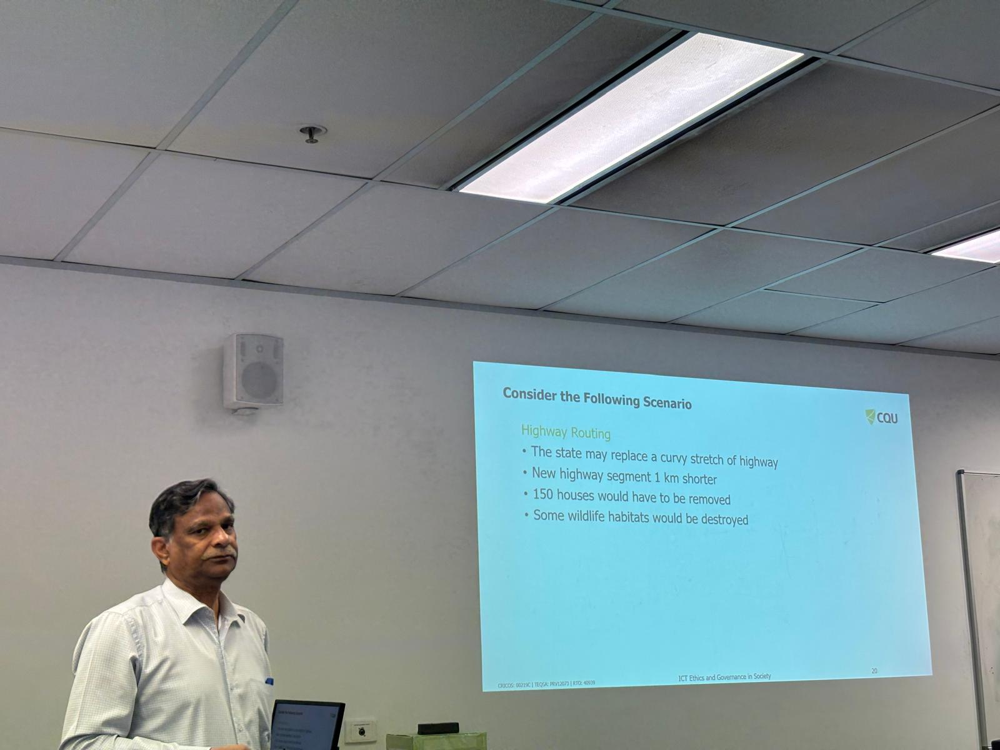
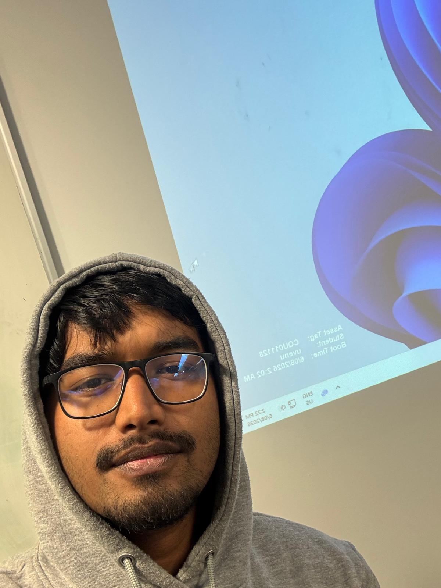

# Week 4: e-portfolio 2 - Ethical Theory
A collection of artefacts that demonstrate what I have learnt about Artificial Intelligence this week.

---
# Artefact 1: AI Hype as a Cyber Security Risk: The Moral Responsibility of Implementing Generative AI in Business
## Screenshot

---
## Link

https://link.springer.com/article/10.1007/s43681-024-00443-4

---

## Summary of the Artefact
This peer-reviewed journal article examines the ethical challenges of implementing generative artificial intelligence (GenAI) in businesses. It explains that while GenAI can improve productivity and decision-making, organisations also have a responsibility to address cybersecurity, privacy, and governance risks. The authors emphasise that businesses should implement strong security controls, transparency, accountability, and responsible AI governance before deploying these technologies (Humphreys et al., 2024, pp. 791–792).

## Justification on the Artefact
I chose this artefact because it strengthened my understanding of ethical responsibility in ICT. Before reading it, I mainly viewed AI as a productivity tool. Afterwards, I realised organisations must also protect customer data, minimise cybersecurity risks, and use AI responsibly. This article clearly links to the ethical theories discussed in the workshop and demonstrates the importance of balancing innovation with ethical decision-making (Humphreys et al., 2024, pp. 794–796).

# Artefact 2: Ethical Hacking and its Role in Cybersecurity
## Screenshot 

---
## Link 

https://arxiv.org/abs/2408.16033

---

## Summary of the Artefact
This review paper explains how ethical hacking strengthens cybersecurity by identifying vulnerabilities before cybercriminals can exploit them. It discusses techniques such as vulnerability scanning, penetration testing, and social engineering while emphasising ethical principles including authorisation, confidentiality, legality, and non-disruption. The authors explain that ethical hacking improves organisational security by reducing risks and protecting sensitive information through responsible cybersecurity practices (Asif et al., 2024, pp. 1–3).

## Justification on the Artefact
I chose this artefact because it changed my understanding of hacking. Before reading it, I mainly associated hacking with cybercrime. Afterwards, I realised ethical hackers help organisations identify security weaknesses before attackers exploit them. This artefact showed me that ICT professionals have an ethical responsibility to protect systems, follow legal requirements, and safeguard users' information. It reinforced the importance of ethical behaviour in creating a safer digital society (Asif et al., 2024, pp. 3–5).

# Artefact 3: The Ethics of AI: Who Controls the Future? 
## Screenshot

---
## Link 

https://www.ie.edu/insights/videos/the-ethics-of-ai-who-controls-the-future/

---

## Summary of the Artefact
This video explores the ethical challenges created by the rapid growth of generative artificial intelligence. David Leslie explains that AI can improve productivity and innovation but also creates risks such as misinformation, bias, privacy concerns, and misuse. He argues that responsible AI requires transparency, accountability, and effective governance to ensure these technologies benefit society while reducing potential harm. The discussion highlights the importance of balancing innovation with ethical responsibility in ICT (Leslie 2025).

## Justification on the Artefact
I chose this artefact because it improved my understanding of AI ethics. Before watching the video, I mainly viewed AI as a useful productivity tool. Afterwards, I realised developers, governments, and organisations share responsibility for ensuring AI is fair, transparent, and accountable. This artefact reinforced the importance of ethical decision-making in ICT and showed that responsible AI helps protect society and build public trust (Leslie 2025).

# Artefact 4: Workshop Reflection – Ethics and Ethical Theories
## Week 4 workshop(Thrusday 06/08/2026) picture of my tutor Umapathy Venugopal sir and my selfie

## Workshop Topic
**Week 4 – Ethical Theories**

---

## Summary of the Artefact: My Personal Reflection
This week's workshop introduced different ethical theories used to evaluate moral dilemmas in ICT. The ideas that stood out most to me were Aristotle's Virtue Ethics and the story of Socrates accepting his death sentence by drinking poison instead of escaping. The tutor explained that Socrates chose to obey the law because he believed respecting society's rules was more important than saving his own life. Aristotle also believed that true happiness comes from living a virtuous life and developing good character rather than focusing only on personal success (COIT11223 Workshop Week 4, 2026).

## Justification on Why I Chose the Artefact
I chose this workshop because it changed the way I think about ethics. Before attending the class, I believed ethical decisions were mainly about following rules. After learning about Aristotle and Socrates, I realised that good character, integrity, and respect for society are equally important. This workshop helped me understand that ICT professionals should not only follow laws but also make responsible decisions that protect others and build trust when developing and using technology (COIT11223 Workshop Week 4, 2026).

---

## Reference (CQU Harvard)
Humphreys, D, Koay, A, Desmond, D & Mealy, E 2024, 'AI hype as a cyber security risk: the moral responsibility of implementing generative AI in business', AI and Ethics, vol. 4, pp. 791–804, viewed 9 August 2026, https://doi.org/10.1007/s43681-024-00443-4.

Asif, F, Sohail, F, Butt, ZH, Nasir, F & Asgar, N 2024, Ethical hacking and its role in cybersecurity: A comprehensive review, arXiv, viewed 9 August 2026, https://arxiv.org/abs/2408.16033

Leslie, D 2025, The ethics of AI: Who controls the future?, video, IE Insights, 13 March, viewed 9 August 2026, https://www.ie.edu/insights/videos/the-ethics-of-ai-who-controls-the-future/.

CQUniversity Australia 2026, COIT11223 ICT Ethics and Governance in Society: Week 4 – Ethics and Ethical Theories, PowerPoint presentation, CQUniversity Australia, viewed 9 August 2026.

